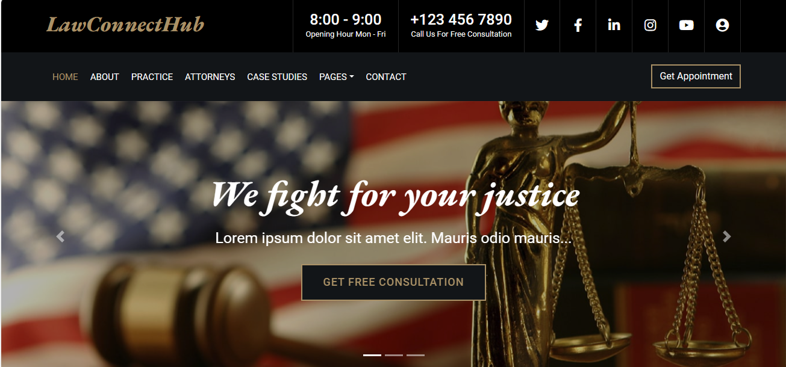
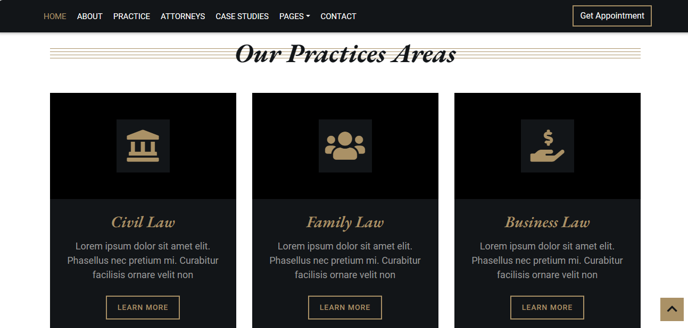
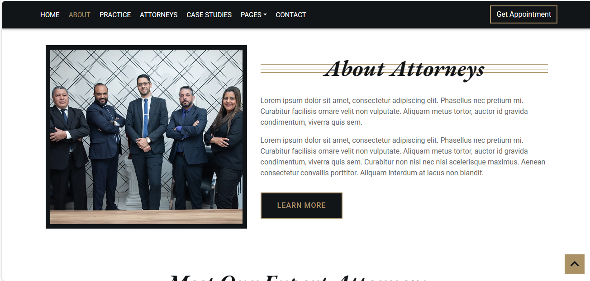
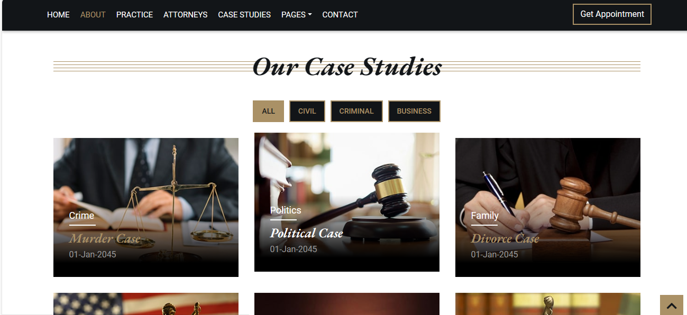
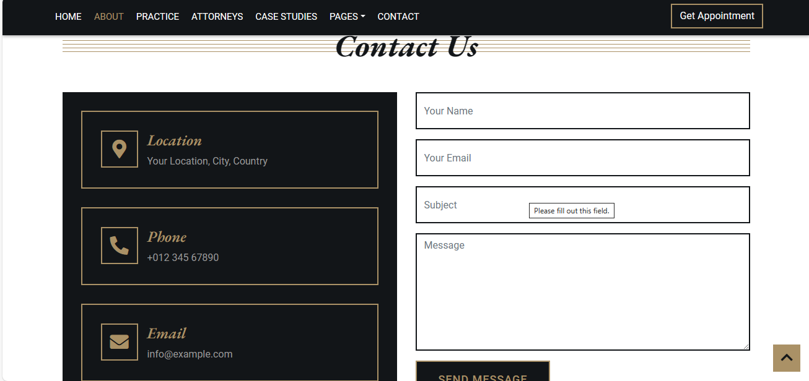
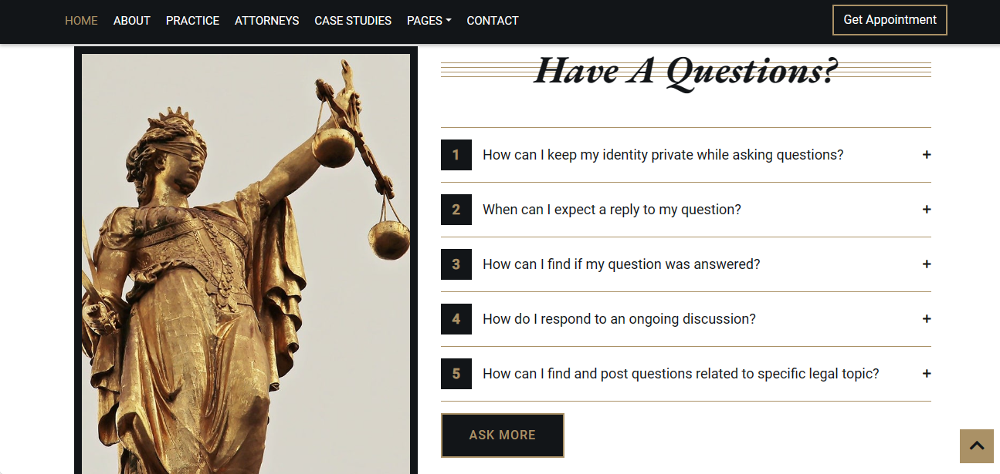

# decisive-duck-1364

# ***NXM301 - Construct Week Project For Unit-6.***

# ***Project Code:- decisive-duck-1364***

# ***Project Purpose:-  Legal Appointment Booking***

***"Welcome to our convenient legal appointment booking platform. Gain access to professional legal expertise effortlessly. Schedule appointments with experienced attorneys for personalized assistance. Your legal solutions are just a click away."***

***

## ***Team Members*** :

***Team Lead ***    : ***Himanshu Jain ***

***Team Member-1 & Student Code*** : ***Preety Kumari ***

***Team Member-2 & Student Code*** : ***Prashant Kad***

***IA Manager: Saurav Das***

***

## ***Tech Stacks***

***Front End: CSS, HTML, JavaScript***

***Back End: CSS, HTML, JavaScript, Node.js, Express, MongoDB, Mongoose, OAuth & npm packages.***

## ***Important Links***

***Project Live Link:- file:///C:/Users/Preety/OneDrive/Desktop/unit-6/decisive-duck-1364/Frontend/html/home.html***

## ***Home Page***

## ***Practice Page***

## ***Attorneys Page***

## ***CaseStudies Page***

## ***Contact Us***

## ***FAQ***

# Thank You

